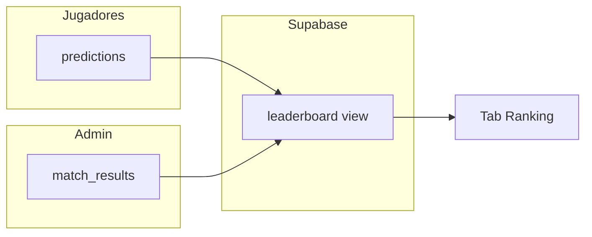

# Prode Mundial 2026

Pronósticos del **Mundial FIFA 2026** (USA · México · Canadá): 104 partidos, tablas simuladas, clasificados y ranking entre amigos.

**Stack:** React 19 + Vite + TypeScript · Supabase (PostgreSQL) · GitHub Pages

---

## Cómo funciona

1. Cada jugador elige un nombre y guarda pronósticos partido a partido.
2. La app calcula **tablas de grupos**, **32 clasificados** y **cruces de eliminatorias** según *tus* resultados (no los oficiales).
3. Un administrador carga los **resultados reales** en la pestaña Admin.
4. El **ranking** suma puntos comparando cada pronóstico con el resultado oficial.



---

## Sistema de puntos del ranking

El ranking solo cuenta partidos que ya tienen **resultado oficial** cargado en `match_results`.

| Situación | Puntos |
|-----------|--------|
| **Resultado exacto** (mismo marcador, ej. pronosticaste 2–1 y salió 2–1) | **3** |
| **Solo ganador** (acertaste el desenlace sin el marcador exacto) | **1** |
| Resultado incorrecto | **0** |

### Qué cuenta como “ganador”

- **Fase de grupos:** victoria local, victoria visitante o **empate** (si pronosticaste 1–1 y salió 0–0, cuenta como 1 pt de “ganador”, no como exacto).
- **Eliminatorias:** si pronosticaste empate en el tiempo reglamentario, tenés que indicar **quién pasa por penales** (`advance_side`). El punto se da si coincide el equipo que avanza con el resultado oficial.

Los puntos **no se suman**: un partido da 3 **o** 1 **o** 0, nunca 3+1.

### Orden en la tabla (quién va primero)

La vista `leaderboard` en Supabase ordena así:

1. **Más puntos totales** (`total_points`)
2. A igualdad: **más resultados exactos** (`exact_hits`)
3. A igualdad: **nombre** alfabético

La columna **Pts** en la app es ese total. **Exactos** y **No exacto** son contadores informativos (cuántos partidos caíste en cada categoría). En la pestaña Ranking hay una leyenda breve con las reglas de puntos.

---

## Tablas y clasificados (simulación)

Las pestañas **Tablas** y **Clasificados** usan **tus pronósticos**, no los resultados reales. Sirven para ver cómo quedaría el torneo si se cumplieran tus resultados.

### Puntos en la fase de grupos (tablas)

Reglas FIFA estándar sobre cada pronóstico de grupo:

| Resultado del partido | Puntos en la tabla |
|---------------------|-------------------|
| Victoria | 3 |
| Empate | 1 |
| Derrota | 0 |

**Desempate** en la tabla: más puntos → mejor diferencia de goles → más goles a favor → orden alfabético del equipo.

### Clasificados a eliminatorias

- **24 equipos:** 1.º y 2.º de cada uno de los 12 grupos.
- **8 equipos más:** mejores terceros (los 12 terceros se comparan entre sí con las mismas reglas de desempate).
- Total: **32** equipos. Los cruces de eliminatorias se resuelven dinámicamente según esos slots.

### Eliminatorias (pronósticos)

- Podés pronosticar **empate** en el marcador (90’/120’).
- Si empatan, elegís **quién pasa por penales** antes de guardar.
- Los partidos se bloquean **24 horas antes** del kickoff (`matchLock`).

---

## Pestañas de la app

| Pestaña | Descripción |
|---------|-------------|
| **Jugar** | Cargar pronósticos; navegación por grupos y fases |
| **Tablas** | 12 tablas calculadas con tus pronósticos |
| **Clasificados** | Los 32 que pasarían según tus grupos |
| **Ranking** | Puntos vs resultados oficiales (vacío hasta que haya resultados cargados) |
| **Admin** | Solo visible para el UUID configurado en `VITE_ADMIN_USER_ID` |

---

## Requisitos

- Node.js 20+
- [pnpm](https://pnpm.io) 10+ (`corepack enable`)
- Proyecto en [Supabase](https://supabase.com)

---

## Configuración

### 1. Variables de entorno

```bash
cp .env.example .env
```

| Variable | Uso |
|----------|-----|
| `VITE_SUPABASE_URL` | URL del proyecto Supabase |
| `VITE_SUPABASE_ANON_KEY` | Clave pública `anon` |
| `VITE_ADMIN_USER_ID` | UUID del jugador admin (`localStorage` → `prode_player_id`) |

Para saber tu UUID: entrá al prode una vez y en la consola del navegador: `localStorage.getItem('prode_player_id')`.

### 2. Base de datos en Supabase

**La app en producción no usa la carpeta `supabase/`.** Solo habla con tu proyecto en la nube vía `VITE_SUPABASE_URL` y `VITE_SUPABASE_ANON_KEY`. GitHub Pages no despliega ni ejecuta esos SQL.

La carpeta `supabase/` en el repo es **documentación y scripts de mantenimiento** (esquema + generadores de partidos). Conviene versionarla en git, pero **no hace falta “migrar” nada en cada deploy**.

| Situación | Qué hacer |
|-----------|-----------|
| **Ya tenés la base configurada** (corriste el SQL antes) | No ejecutes nada más. Solo `.env` y listo. |
| **Proyecto Supabase nuevo** | Una sola vez: pegá y ejecutá [`supabase/migrations/full_schema.sql`](supabase/migrations/full_schema.sql) en el **SQL Editor** de Supabase. |
| **Cambio de esquema en el futuro** | Solo entonces aplicá el `.sql` nuevo que corresponda (no usamos Supabase CLI ni `supabase db push`). |

Los archivos `001` … `006` en `supabase/migrations/` son el historial incremental; para un setup nuevo alcanza con **`full_schema.sql`**. Si aplicaste la allowlist (`005`) y querés volver al acceso abierto, ejecutá **`006_restore_open_access.sql`**.

Si regenerás partidos o el schema desde código (opcional, solo desarrollo):

```bash
pnpm run seed:sql          # actualiza 002_world_cup_2026.sql
pnpm run seed:full-schema  # actualiza full_schema.sql
```

### 3. Desarrollo local

```bash
corepack enable
pnpm install
pnpm dev
```

### 4. GitHub Pages

1. **Settings → Pages → Source:** GitHub Actions  
2. Secrets del repositorio:

| Secret | Descripción |
|--------|-------------|
| `VITE_SUPABASE_URL` | URL de Supabase |
| `VITE_SUPABASE_ANON_KEY` | Anon key |
| `VITE_ADMIN_USER_ID` | UUID del administrador |

3. Push a `main` → el workflow [`.github/workflows/deploy-pages.yml`](.github/workflows/deploy-pages.yml) publica en `https://<usuario>.github.io/prode/`

Si el repo tiene otro nombre, cambiá `base` en [`vite.config.ts`](vite.config.ts).

---

## Scripts

| Comando | Descripción |
|---------|-------------|
| `pnpm dev` | Servidor de desarrollo |
| `pnpm build` | Build de producción |
| `pnpm preview` | Vista previa del build |
| `pnpm lint` | ESLint |
| `pnpm test` | Tests unitarios (Vitest) |
| `pnpm audit:ci` | Auditoría de dependencias (falla en high/critical) |
| `pnpm run seed:sql` | (Opcional) Regenera SQL de partidos en `supabase/migrations/` |
| `pnpm run seed:full-schema` | (Opcional) Regenera `full_schema.sql` |
| `pnpm run flags:copy` | Copia banderas SVG a `public/flags/` |

---

## Estructura del proyecto

```
src/
  components/     # UI (partidos, tablas, ranking, admin)
  lib/            # Lógica: scoring, standings, bracket, API
  i18n/           # Español / inglés
  data/           # Grupos WC2026, mapa de banderas
supabase/         # Solo referencia / setup inicial (no va al build)
  migrations/     # SQL para pegar en Supabase Editor
  seed/           # Fuente TS para regenerar esos SQL
public/flags/     # Banderas locales (SVG)
```

---

## Seguridad y CI

Ver también [`SECURITY.md`](SECURITY.md).

- Sin login: cada navegador guarda un UUID en `localStorage` y elige su nombre al entrar.
- RLS abierta para `anon` en pronósticos y resultados (grupo cerrado de confianza).
- La pestaña Admin solo se muestra si `playerId === VITE_ADMIN_USER_ID` (no es seguridad fuerte ante quien use la API directamente).

### CI/CD (GitHub Actions)

| Workflow | Cuándo | Qué hace |
|----------|--------|----------|
| [`.github/workflows/ci.yml`](.github/workflows/ci.yml) | PR y push a `main` | `lint`, `test`, `build` (env dummy), `pnpm audit` |
| [`.github/workflows/deploy-pages.yml`](.github/workflows/deploy-pages.yml) | Push a `main` | Quality gates + deploy a Pages |

Recomendado: **branch protection** en `main` → requerir que el check `CI` pase antes de merge.

---

## Fuentes del fixture

- Fase de grupos: calendario post-sorteo (Olympics.com / FIFA)
- Eliminatorias: FIFA / Wikipedia — 2026 knockout stage
