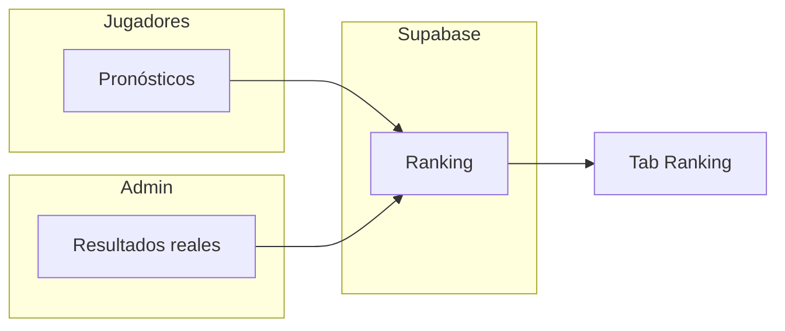

# Prode Mundial 2026

Pronosticá el **Mundial FIFA 2026** (USA · México · Canadá) con amigos: cargá resultados partido a partido, mirá cómo quedarían las tablas con tus pronósticos y competí en el ranking cuando haya resultados oficiales.

---

## Detrás de escena (sin spoilear todo)

La app es una **web estática** hecha con **React** y **Vite**: corre en el navegador, carga rápido y no hace falta instalar nada.

Los pronósticos y el ranking viven en **Supabase** (base en la nube), así todos ven los mismos partidos y puntajes al instante. El sitio se publica en **GitHub Pages**; cada deploy nuevo sale cuando actualizamos `main`.

Cómo calculamos cruces, desempates y el ranking exacto… eso se queda en el código (y en un par de decisiones nuestras). Si te copás el repo, vas a ver la estructura; si solo jugás, alcanza con saber que **simulación** y **puntos oficiales** no son la misma cosa a propósito.

---

## Cómo se usa

1. Entrás, elegís un nombre y guardás pronósticos.
2. En **Tablas** ves cómo quedarían los grupos **si se cumplieran tus resultados** (no los oficiales).
3. Quien administra el prode carga los **resultados reales** en **Admin**.
4. En **Ranking** se suman los puntos comparando tus pronósticos con esos resultados.



| Pestaña | Para qué sirve |
|---------|----------------|
| **Jugar** | Cargar pronósticos partido a partido |
| **Resultados** | Ver y cambiar pronósticos ya guardados (hasta 24 h antes del partido) |
| **Tablas** | Posiciones de grupos según tus pronósticos |
| **Ranking** | Puntos vs resultados oficiales |
| **Admin** | Cargar resultados reales (solo el administrador) |

Los partidos se bloquean **24 horas antes** del inicio.

---

## Puntos en el ranking

Solo cuentan partidos con resultado oficial cargado.

| Acertás… | Puntos |
|----------|--------|
| Marcador exacto (ej. 2–1 y salió 2–1) | **3** |
| Solo el desenlace (ganó local, visitante o empate, sin el marcador) | **1** |
| Mal | **0** |

No se suman: cada partido da 3, 1 o 0.

### Qué cuenta como “ganador” (el punto de 1)

- **Fase de grupos:** acertás si coinciden local, visitante o **empate**. Ej.: pronosticaste 1–1 y salió 0–0 → **1 pt** (mismo desenlace, no exacto).
- **Eliminatorias:** con empate en el marcador tenés que elegir **quién pasa por penales**. El punto de 1 es si coincide **quien avanza**, no solo el empate en el resultado.

### Orden de la tabla (ranking)

Quién va primero:

1. **Más puntos** (columna **Pts**)
2. A igualdad de puntos: **más exactos**
3. Si siguen empatados: **nombre** alfabético

**Exactos** y **No exacto** son contadores: cuántos partidos acertaste con 3 pts o con 1 pt. No definen el orden por sí solos, salvo en el desempate del paso 2.

---

## Tablas y eliminatorias (simulación)

Acá valen **tus** pronósticos, no los resultados reales del Mundial.

### Tablas de grupos

Puntos por partido (como en la fase de grupos FIFA):

| Resultado | Puntos |
|-----------|--------|
| Victoria | 3 |
| Empate | 1 |
| Derrota | 0 |

**Desempate** en la tabla (según [Reglamento FIFA Mundial 2026](https://digitalhub.fifa.com/m/636f5c9c6f29771f/original/FWC2026_regulations_EN.pdf), artículo 13): más puntos → enfrentamientos directos entre empatados (puntos, diferencia y goles a favor en esos partidos, con re-aplicación si siguen empatados) → diferencia de goles en todo el grupo → goles a favor en todo el grupo → ranking FIFA/Coca-Cola (snapshot en `src/data/wc2026-fifa-ranking.ts`). El **fair play** (tarjetas) no se simula porque no hay datos de tarjetas en el prode.

Los **mejores 8 terceros** usan puntos, diferencia y goles en todos los partidos del grupo, luego ranking FIFA (sin mini-liga entre terceros). Con eso se arman los **32** clasificados a eliminatorias (24 por 1.º/2.º de grupo + 8 terceros) y los cruces del cuadro según las reglas del Mundial 2026.

### Eliminatorias

- Podés pronosticar **empate** en el marcador (90’ / 120’).
- Si empatan, elegís **quién pasa por penales** antes de guardar.
- Los partidos de cada ronda se van desbloqueando según **tus** resultados anteriores: el rival de un cruce puede cambiar si cambiás un pronóstico de fase previa.

---

## Desarrollo y despliegue

Para correr el proyecto en tu máquina o publicarlo en GitHub Pages hace falta un proyecto en [Supabase](https://supabase.com) y un archivo `.env` (copiá `.env.example`).

| Variable | Uso |
|----------|-----|
| `VITE_SUPABASE_URL` | URL del proyecto |
| `VITE_SUPABASE_ANON_KEY` | Clave pública |
| `VITE_ADMIN_USER_ID` | UUID del administrador |

Base nueva en Supabase: ejecutá una vez [`supabase/migrations/full_schema.sql`](supabase/migrations/full_schema.sql) en el SQL Editor.

```bash
corepack enable && pnpm install && pnpm dev
```

**GitHub Pages:** en Settings → Pages elegí GitHub Actions. Configurá las tres variables anteriores como secrets o variables del repo o del environment `github-pages`. Push a `main` despliega automáticamente.

Más detalle técnico: [`SECURITY.md`](SECURITY.md), carpeta `supabase/`, workflows en `.github/workflows/`.

---

## Estructura del proyecto

```
src/
  components/     # Pantallas y UI (partidos, tablas, ranking, admin)
  lib/            # Lógica del torneo y conexión con Supabase
  i18n/           # Textos en español e inglés
  data/           # Grupos del Mundial y banderas
supabase/
  migrations/     # SQL para armar la base (una vez en Supabase)
  seed/           # Generadores internos de esos SQL
public/flags/     # Banderas en SVG
```

---

## Fuentes del fixture

- **Fase de grupos:** calendario post-sorteo (Olympics.com / FIFA)
- **Eliminatorias:** FIFA / Wikipedia — [2026 knockout stage](https://en.wikipedia.org/wiki/2026_FIFA_World_Cup_knockout_stage)
